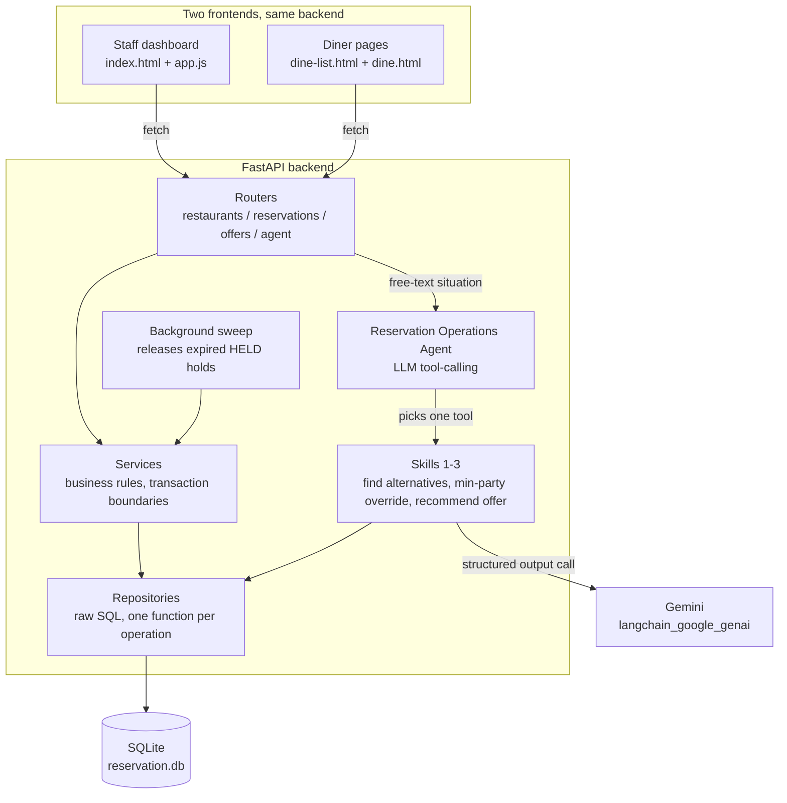

# Reservation Intelligence

A restaurant reservation system with an agentic layer on top: table booking with
real concurrency safety, plus agent skills that assist staff with seating and
promotional decisions inside clearly defined autonomy boundaries.

## Status

Feature-complete for the minimum requirements: database schema, reservation
lifecycle, dynamic pricing, the booking API, all three agent skills, the
Reservation Operations Agent, and a dashboard tying it together. Both
dashboards also have a "Run Demo" button, a scripted walkthrough for
recording an explanation video, see Demo mode below.

## Demo mode

`/`, `/dine`, and `/dine/{id}` each have a "Run Demo" button that drives the
real UI end to end, real typed text, real button presses, real API calls,
nothing staged. Captions stay short and plain, stating what's happening and
why it matters in a sentence, not the full engineering justification behind
it, that depth is meant for a separate talking-head explanation recorded
after, not narrated live over the mouse. The staff demo opens with a brief
intro before anything starts happening, covers a happy-path booking, a genuine
conflict triggered through a real edit to an already-taken slot (skill 1
suggesting, and moving the reservation to, an alternative), an
under-minimum party size (skill 2), the promo recommendation (skill 3,
reacting live to whatever it actually decides), the free-text agent panel
routing correctly, and a cancellation, then navigates into the diner-facing
side, starting with the restaurant browse list, the actual demonstration of
comparing real, seeded occupancy differences across restaurants, before
continuing into one restaurant's page. There, a diner deliberately tries to
book the exact table and time staff just confirmed on the other dashboard,
a genuine collision carried across the page navigation (not two disconnected
recordings), showing the same skill 1 alternative-suggestion flow from the
diner's own side this time, live occupancy, active offers, and booking round
out the page. A control panel (pause/next/speed/restart/hide) lets the pace follow
your narration rather than a fixed timer. Reaching the end, or
"Restart"/"Close", all clean up everything the run created, reservations
cancelled, any offer it generated deleted outright (offers have no
cancel-equivalent, so a genuine delete exists for this, used only by demo
cleanup, never by normal offer management), so it can be rehearsed as many
times as needed before recording for real, with no leftover clutter between
runs.

## Requirements

- Python 3.12+
- No Docker, no external services. SQLite runs as a plain local file.
- A Google Gemini API key, only needed to actually run the agent skills.
  Everything else (booking, pricing, availability) works without one.

## Setup

```bash
pip install -r requirements.txt
cp .env.example .env  # then fill in GOOGLE_API_KEY
```

## Running the app

```bash
uvicorn app.main:app --reload
```

Then open `http://localhost:8000` for the staff dashboard (scoped to "The
Rosemary"), or `http://localhost:8000/dine` for the diner-facing view, a
browse list across all seeded restaurants, each showing its live vibe, click
through to `/dine/{id}` to see one restaurant's occupancy in detail and book.
Also linked from the staff dashboard's header. On startup, the app creates
the SQLite database (`reservation.db`) if it does not exist yet, applies the
schema, and seeds it with sample data, three restaurants (so the diner browse
view has something real to compare), a handful of tables and menu items each,
and two users. It also seeds a demo occupancy baseline for today, some tables
confirmed all day so The Rosemary reads as comfortably busy and Nomad Kitchen
as lively, while Blue Anchor is deliberately left alone as the genuinely
quiet one, so browsing by vibe shows real contrast rather than three
identical 0%s. This runs on every startup (not just when the database is
first created), so it stays correct across days without needing a fresh
database.

## Running the tests

```bash
pytest
```

## Architecture



Two things worth calling out visually: routers never write directly, they call into Services, which
own transaction boundaries, before anything reaches SQLite. Skills sit slightly outside that layering
on purpose, they call Repositories directly (the only place SQL lives) to gather the context they
reason over, and skill 3 specifically, the one skill that writes anything, inserts its offer the same
way, straight through the repository, not routed back through Services. A real, minor asymmetry
worth naming rather than glossing over: skills 1 and 2 never mutate anything (pure reads, a
suggestion is the only output), so it never came up for them, and skill 3's own write is a single
`INSERT` with no multi-step transaction to coordinate, unlike the booking flow's atomic multi-slot
claim, so the gap has never actually mattered in practice, but it is a real inconsistency, not a
deliberate design choice.

- `app/database.py`: SQLite connection handling, schema definition, and the
  `transaction()` context manager used everywhere a write needs to be atomic.
- `app/repositories/`: raw data access, one function per operation, no
  business logic. The only place SQL is allowed to live.
- `app/services/`: business rules and transaction boundaries, built on top of
  the repositories. Reservation release (on cancellation or expiry) and
  demand-driven pricing live here.
- `app/routers/`: the FastAPI route handlers, one module per resource, thin,
  they call into services and repositories, never SQL directly.
- `app/skills/`: agent skills. Each one gathers context through the existing
  repositories/services, then makes a single structured-output LLM call to
  reason over it. Skills 1 and 2 only ever suggest, they never mutate
  anything, the caller decides whether to act. Skill 3 is graduated instead
  of binary: a promotional discount within a menu item's pre-approved ceiling
  is created live immediately, above the ceiling it's created pending staff
  approval, that's the only skill that writes to the database itself.
- `app/reservation_agent.py`: the Reservation Operations Agent. Takes a
  plain-language description of a staff situation, binds all three skills to
  an LLM as tools, and lets the LLM decide which one applies. The agent only
  ever decides *which* skill to run, it never mutates anything itself.
- `app/main.py`: the FastAPI app, including a background task that sweeps for
  expired holds on a fixed interval, so a reservation's stored status stays
  accurate without depending on something else happening to read or contend
  for it, and serves the dashboard.
- `app/static/`: two separate frontends, plain HTML/CSS/vanilla JS, no build
  step. `index.html`/`app.js` is the staff dashboard, dense, wide, an ops
  tool, with a sticky left nav (new reservation, reservations, tables,
  menu & offers, agent) that smooth-scrolls to and highlights whichever
  section is in view, so any section is one click away without hunting
  through the page; the agent surfaces in context rather than as a
  separate playground:
  skill 1 appears inline when a booking attempt just failed, skill 2 appears
  inline next to a table flagged below its minimum party size, skill 3 has a
  direct "recommend a promo" action in the offers section, and a free-text
  panel demonstrates the Reservation Operations Agent's actual routing
  behavior directly. `dine-list.html`/`dine.html` are the diner-facing pages,
  a warmer, single-column, "restaurant site" feel, deliberately distinct from
  the staff view: browse restaurants by their live vibe, then book on one
  restaurant's page, with a real visual occupancy indicator (fill bar plus a
  dot per actual table), not just a percentage in text. `demo-common.js` is
  the shared scripted-walkthrough engine (panel UI, pacing, pause/next/
  restart, real typed input, click-press feedback, lazy caption resolution
  for wording that depends on state not known until a step's own action
  runs); `demo.js`, `dine-list-demo.js`, and `dine-demo.js` each define that
  page's own step list on top of it and chain into the next page via a
  `?demo=1` flag, see Demo mode above.

## API overview

- `GET /restaurants`, `GET /restaurants/{id}`, `GET /restaurants/{id}/tables`,
  `GET /restaurants/{id}/availability`, `GET /restaurants/{id}/occupancy`
  (occupied/total table counts, ratio, and a diner-facing vibe label),
  `GET /users`: browsing.
- `POST /reservations`, `GET /reservations/{id}`,
  `POST /reservations/{id}/confirm`, `POST /reservations/{id}/cancel`,
  `POST /reservations/{id}/modify`: booking lifecycle. Every reservation
  response includes the actual booked
  `booking_date`/`start_hour`/`start_minute`/`duration_minutes`, derived
  fresh from `slot_claim` on every read, not stored redundantly, `null` once
  a reservation is cancelled or expired and no longer holds any slot.
  `modify` moves a `HELD`/`CONFIRMED` reservation to a different table and/or
  time atomically, releasing its current slots and claiming the new ones
  inside one transaction, so a conflict on the new slot rolls back the whole
  move and leaves the reservation exactly as it was, rather than the real
  gap in "cancel, then rebook" as two separate requests, a failed rebook
  step there would leave the reservation cancelled with no replacement.
- `POST /agent/find-alternatives`: skill 1, suggests an alternative table or
  time after a failed booking attempt, reused as-is for a failed edit too
  (accepting a suggestion there moves the existing reservation via `modify`
  instead of creating a new one).
- `POST /agent/evaluate-min-party-override`: skill 2, evaluates whether to
  seat a party below a table's minimum size, given current demand.
- `POST /agent/recommend-offer`: skill 3, recommends a promotional offer when
  occupancy is low, creating it live or pending staff approval depending on
  whether it's within the menu item's pre-approved discount ceiling.
- `POST /agent/handle`: the Reservation Operations Agent entry point, describe
  a situation in plain language, it decides which skill (if any) applies.
- `GET /restaurants/{id}/menu-items`, `GET /restaurants/{id}/offers`,
  `POST /offers` (staff-created, always live immediately),
  `POST /offers/{id}/approve`, `POST /offers/{id}/reject`,
  `POST /offers/{id}/cancel` (ends a currently-`ACTIVE` offer early, a
  genuinely distinct end state from `REJECTED`, which means "never went
  live" instead), `POST /offers/{id}/edit` (changes the discount amount;
  a human setting the value directly needs no separate confirmation, so
  it always lands on `ACTIVE`, closing out a pending approval if there
  was one): offer management. `DELETE /offers/{id}` also exists,
  demo-mode cleanup only, real offers stay auditable via status
  transitions, this is never used by normal offer management.

### Concurrency model, in short

Reservations are quantized into 15 minute slots. A reservation claims a set of
rows in `slot_claim`, one per slot, with a `UNIQUE(table_id, slot_index, date)`
constraint. Two overlapping bookings can never both succeed, the database
enforces it directly, rather than the application checking availability and
then writing in two separate steps. All of a reservation's slot claims are
inserted inside a single transaction, so a reservation can never end up
partially booked.
